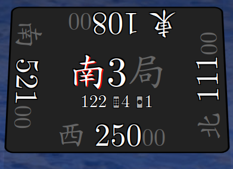

<h1 align="center">
    🀄 <a href="https://mahtools.github.io/riichi-centrepiece/">Riichi Centrepiece</a> 🀄
</h1>

- A round/honba tracker to aid during play -

## 📝 About 📝
A centrepiece in Riichi is a tool that helps track the current round and seat winds, they are found on a lot of online websites and real-life tables:

    
    
Example of a centrepiece on the <a href="https://tenhou.net/">Tenhou</a> client.

Riichi Centrepiece is a web app that tracks:
- The round wind
- The seat winds
- The [honba](https://riichi.wiki/Honba)

Intended to be placed in the middle of the table during a game of Riichi Mahjong. 

It is written as a single-page and single-file web app with no external dependencies. Just a browser and JavaScript!

## 👷 Use 👷
### Use online 🌐
You can head over to the [Github Pages](https://mahtools.github.io/riichi-centrepiece/) site and start using the app. 

Once opened it has no dependency on a stable internet connection to keep working.

### Use offline 🌐🚫
The app is contained within a single html file. Download the file from the [master branch](https://github.com/mahtools/riichi-centrepiece/blob/master/index.html) or from the [releases tab](https://github.com/mahtools/riichi-centrepiece/releases) and run it inside your preferred web browser.

### Controls
The middle of the screen there is two strings of text. The top one is the *round tracker*, it shows you the current round wind and round number. The bottom one is the honba tracker, which shows you which repeat you are on.

Click either one of these to increment them. Once the round counter exceeds 4, it will wrap back around to 0 and set the wind accordingly.

## Supports

| Supported | Match type | Winds | Rounds/Wind | 
| --- | --- | --- | --- | 
| ✅ | Full-length | 4 | 4 |
| ❌ | Full-length sanma | 3 | 3 |
| ❌ | Hanchan | 2 | 4 |
| ❌ | Hanchan sanma | 2 | 3 |
| ❌ | Tonpuusen | 1 | 4 |
| ❌ | Tonpuusen sanma | 2 | 3 |
